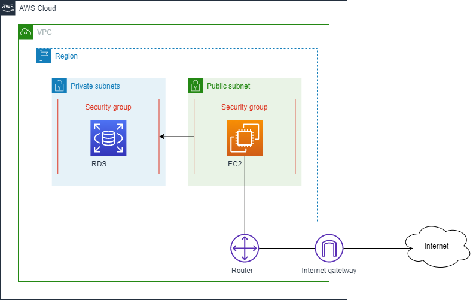

# Seera Code Challenge

Bring up a WordPress stack using any of the infrastructures as code tools (Cloudformation / Terraform). This should create new VPC with subnets, route tables, etc. The database should use RDS.

The service should be fault tolerant (no need of HA). In case of a server failure, during termination of existing server, a new server should come up and configure everything automatically. The service should come back to existing state without any manual interventions.

For the WordPress app, you can use EC2 with standalone WordPress installation or Docker if you want to containerize it.

You can use any tools of your choice (CF, terraform, Ansible, Docker, Mesos, ECS, K8s, Shell scripts, boto, etc) to accomplish this task. Once the code is completed please push it to GitHub with instructions to bring up the stack. Please write those instructions as complete as possible, detailing any consideration you would like to explain regarding the solution, or any assumption we should take into consideration.

## Network Architecture

## Providers

| Name | Version |
|------|---------|
| terraform | >1.0.3 |

## Usage

### Create infrastructure and provisioning

1. `terraform init`
2. `terraform plan -var-file=dev.tfvars -out=tfplan`
3. `terraform apply -auto-approve -input=false tfplan`

### Delete the resources

1. `terraform destroy -auto-approve -var-file=dev.tfvars`